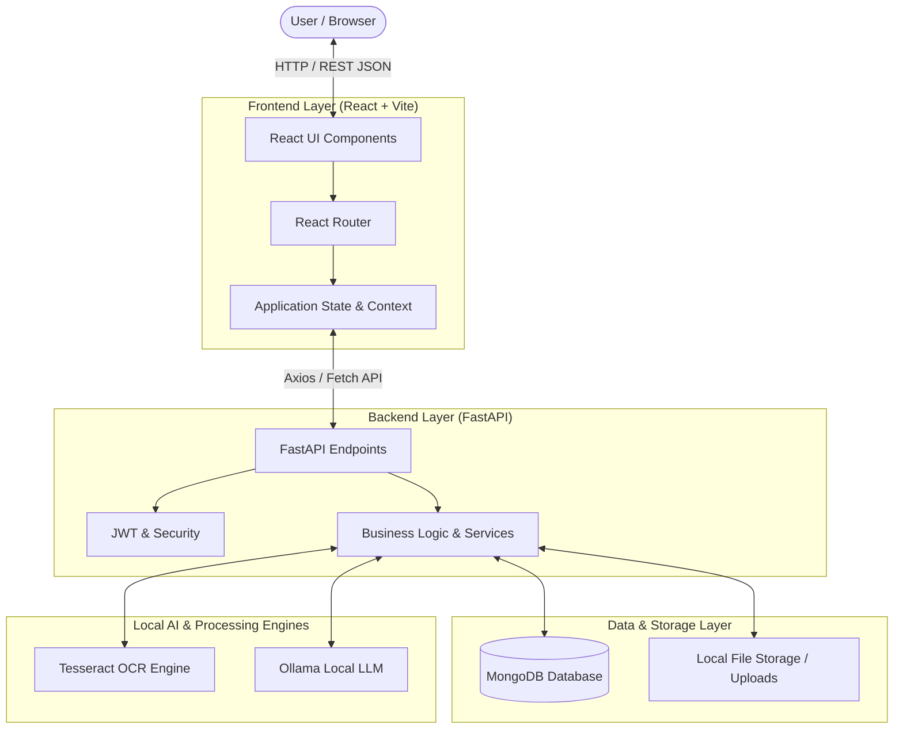

# OWNIT - System Architecture

> **Tagline**: *"Own More. Worry Less."*  
> **Concept**: Smart Product Lifecycle Assistant

This document outlines the architectural blueprint for the OWNIT application, highlighting data flow, module boundaries, and foundational engineering principles.

---

## 1. System Overview

OWNIT is designed with a decoupled **Client-Server (Monorepo)** architecture:



---

## 2. Directory Structure

The project maintains clean separation of concerns:

```text
OWNIT/
├── frontend/                  # React Application
│   ├── public/                # Static public assets
│   ├── src/                   # Source code
│   │   ├── assets/            # Images, icons, and media
│   │   ├── components/        # Reusable UI components
│   │   ├── pages/             # Route-level view components
│   │   ├── services/          # API client and network calls
│   │   ├── context/           # Global auth & state management
│   │   ├── App.jsx            # Root component
│   │   ├── main.jsx           # React DOM entry point
│   │   └── index.css          # Global styling & design tokens
│   ├── .env.example           # Frontend environment template
│   ├── package.json           # Node dependencies and scripts
│   └── vite.config.js         # Vite configuration
│
├── backend/                   # FastAPI Application
│   ├── app/                   # Backend application package
│   │   ├── api/               # API routes and controllers
│   │   ├── core/              # Configuration, settings, and security
│   │   ├── models/            # Database schemas & models
│   │   ├── schemas/           # Pydantic validation schemas
│   │   └── services/          # Business logic (OCR, AI, DB queries)
│   ├── .env.example           # Backend environment template
│   ├── requirements.txt       # Python dependencies
│   └── main.py                # FastAPI app entry point
│
├── docs/                      # Architectural & setup documentation
│   ├── architecture.md        # System architecture and design
│   ├── development.md         # Local setup & developer workflow
│   └── roadmap.md             # Project milestones and feature modules
│
├── .gitignore                 # Global Git ignore rules
└── README.md                  # Project landing page & quick start
```

---

## 3. Layer Breakdown

### A. Frontend (Presentation Layer)
- **Framework**: React 18+ with Vite for ultra-fast HMR (Hot Module Replacement) and bundling.
- **Routing**: `react-router-dom` for client-side navigation.
- **Styling**: Modern clean CSS with consistent CSS variables for theming and mobile responsiveness.
- **Data Fetching**: Standard `fetch` / `axios` communicating with FastAPI endpoints.

### B. Backend (Application & API Layer)
- **Framework**: FastAPI (Python) utilizing asynchronous handlers (`async`/`await`).
- **Configuration**: Pydantic Settings (`pydantic-settings`) for environment variable validation and strict typing.
- **API Documentation**: Automatic interactive OpenAPI/Swagger docs generated at `/docs`.

### C. Data & AI Pipeline
- **Database**: MongoDB for storing user records, product profiles, warranty terms, and service logs.
- **OCR Engine**: Tesseract OCR for local text extraction from uploaded images/PDFs.
- **AI Processing**: Ollama local instance running open-source models (e.g., LLaMA 3 / Mistral) for parsing extracted OCR text into structured product data and answering warranty queries.
- **Privacy Assurance**: All OCR parsing and AI inference occur completely locally on the user's machine without transmitting documents to third-party cloud APIs.
