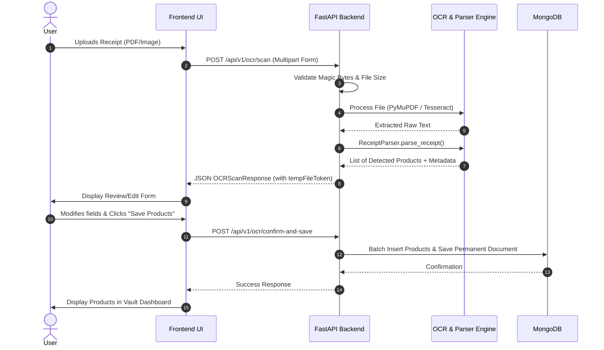
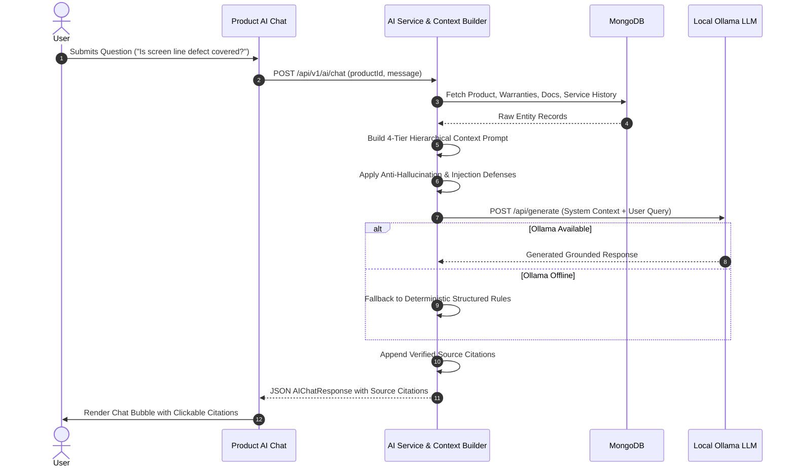

# OWNIT - System Architecture Documentation

> **Tagline**: *"Own More. Worry Less."*  
> **Concept**: Smart Product Lifecycle Assistant  
> **Target Audience**: Academic / College Project Reviewers, Software Engineers, and Evaluators

---

## 1. Executive Summary & Problem Statement

### 1.1 The Real-World Problem
In modern households and workplaces, consumers purchase numerous consumer electronics, home appliances, computing equipment, and tools. Each product involves critical lifecycle data:
- Paper and digital tax invoices
- Manufacturer warranty certificates and extended warranty cards
- Specific retailer return and replacement deadlines
- Periodic preventive maintenance schedules (e.g., filter cleaning, descaling, inspections)
- Repair logs, Job Sheet IDs, and authorized service center contacts
- Recalls and safety bulletins issued by manufacturers or regulatory bodies

Typically, this data is scattered across email inboxes, paper folders, SMS receipts, and obscure OEM websites. Consequently, users frequently miss return windows, let active warranties expire unnoticed, neglect preventive maintenance, and struggle to compile necessary evidence when filing repair claims.

### 1.2 The OWNIT Solution
**OWNIT** is a unified, privacy-first **Smart Product Lifecycle Assistant** that consolidates all product ownership information into an intelligent digital vault. Key capabilities include:
1. **Automated Receipt Ingestion**: Multi-engine OCR (Tesseract + PyMuPDF) parses paper bills and e-invoices, extracting multiple products, purchase dates, serial numbers, and prices automatically.
2. **Multi-Tier Warranty & Return Tracking**: Monitors return deadlines and multi-component warranties (Comprehensive, Display Panel, Compressor, Motor) with automated milestone notifications (30d, 15d, 7d, 1d, 0d).
3. **Product Life Score & Lifecycle Timeline**: Computes a dynamic 0–100 health score evaluating documentation completeness, active coverage, age, and maintenance compliance.
4. **Context-Grounded Local AI Assistant**: A private conversational assistant powered by a local Large Language Model (via Ollama) anchored to verified product data, enforcing anti-hallucination guardrails and prompt injection defenses.
5. **Warranty Intelligence & Claim Dossier Assistant**: Evaluates problem coverage against warranty clauses and synthesizes editable claim letters with complete evidence checklists.
6. **Accessory Compatibility & Recall Bulletins**: Recommends accessories based on verified dimensions and interfaces, and scans registered devices against official OEM safety bulletins.
7. **Multilingual Interface**: Full native support for English, Hindi (हिंदी), and Telugu (తెలుగు).

---

## 2. High-Level Architectural Design

OWNIT follows a clean, decoupled **Client-Server Architecture** structured into distinct presentation, application, domain service, persistence, and local intelligence layers.

```mermaid
graph TD
    Client([User Web Browser])
    
    subgraph FrontendLayer ["Frontend Layer (React 18 + Vite)"]
        UI[React UI Components & Views]
        Router[React Router DOM]
        AuthCtx[Auth & Session Context]
        ThemeLang[Language & Localization Context]
        ApiBridge[Axios HTTP API Client]
    end
    
    subgraph BackendLayer ["Backend Application Layer (FastAPI + Python 3.12)"]
        Middleware[CORS, Error Handlers, Rate Limiting]
        Routers[FastAPI API v1 Routers]
        AuthGuard[JWT Bearer Auth & Security Guards]
        
        subgraph DomainServices ["Core Domain Services"]
            UserService[User & Auth Service]
            ProductService[Product & Search Service]
            WarrantyService[Warranty & Expiry Engine]
            OCRService[OCR & Receipt Parser Engine]
            DocService[Document & Storage Service]
            LifeScoreService[Life Score Evaluation Engine]
            TimelineService[Lifecycle Timeline Engine]
            MaintService[Maintenance Service]
            ServiceHistService[Service History Service]
            NotifService[Milestone Notification Service]
            AccessoryService[Accessory Recommendation Engine]
            RecallService[Safety & Recall Engine]
            AIService[Ollama LLM Orchestrator]
            ContextBuilder[4-Tier Context Builder]
            ClaimService[Claim Assistant Service]
            WarrantyIntelService[Warranty Intelligence Service]
        end
    end
    
    subgraph PersistenceLayer ["Storage and Persistence Layer"]
        MongoDB[(MongoDB Database Engine)]
        FileSystem[(Secure Local Uploads Directory)]
    end
    
    subgraph LocalEngines ["Intelligent Processing Engines (Local / Offline)"]
        Tesseract[Tesseract OCR Engine]
        PyMuPDF[PyMuPDF Vector Text Parser]
        Ollama[Ollama Local LLM (llama3.2 / mistral)]
    end

    Client <-->|HTTPS / REST JSON| UI
    UI --> Router
    UI --> AuthCtx
    UI --> ThemeLang
    UI --> ApiBridge
    ApiBridge <-->|HTTP / JSON + Bearer JWT| BackendLayer
    
    BackendLayer --> Middleware
    Middleware --> Routers
    Routers --> AuthGuard
    AuthGuard --> DomainServices
    
    UserService <--> MongoDB
    ProductService <--> MongoDB
    WarrantyService <--> MongoDB
    DocService <--> MongoDB
    DocService <--> FileSystem
    NotifService <--> MongoDB
    MaintService <--> MongoDB
    ServiceHistService <--> MongoDB
    
    OCRService <--> Tesseract
    OCRService <--> PyMuPDF
    OCRService <--> FileSystem
    
    AIService <--> Ollama
    ContextBuilder --> DomainServices
    WarrantyIntelService --> DomainServices
    ClaimService --> DomainServices
```

---

## 3. Detailed Layer Breakdown

### 3.1 Presentation Layer (Frontend)
- **Framework**: React 18 with Vite build tooling for fast HMR and optimized production bundles.
- **Routing**: React Router v6 managing client-side navigation with protected route wrappers (`PrivateRoute`).
- **State Management**: React Context API (`AuthContext` for credentials, `LanguageContext` for multilingual translations, and local component states).
- **Design System**: Modular CSS design system utilizing CSS Custom Properties (design tokens for colors, typography, elevations, spacing, and glassmorphism cards).
- **Icons**: Lucide React for consistent vector iconography.
- **Responsive Layout**: Mobile-first responsive layouts adapting gracefully from smartphones (320px) to ultra-wide desktop monitors (1920px+).

### 3.2 Application Layer (Backend)
- **Framework**: FastAPI (Python 3.12) utilizing asynchronous coroutines (`async`/`await`) for high concurrency and non-blocking I/O.
- **Server**: Uvicorn ASGI server with configurable worker processes.
- **Data Validation & Typing**: Pydantic v2 schemas providing compile-time type hints and runtime validation for all API inputs and outputs.
- **Security & Authorization**: Centralized dependency injection (`get_current_user`) validating signed HS256 JWT tokens and extracting user IDs.
- **Error Handling**: Global exception interceptor (`AppException`) returning standardized JSON error envelopes with human-readable error messages and diagnostic details.

### 3.3 Persistence Layer (Database & Filesystem)
- **Database**: MongoDB 6.0+ operated via Motor (the official asynchronous Python driver for MongoDB).
- **Data Isolation**: Multi-tenant architecture where every document across all collections is strictly keyed by `userId`.
- **Compound Indexing**: Performance-optimized compound and unique indexes to prevent duplicate notification triggers and guarantee O(1) username lookups.
- **Document Storage**: Uploaded invoices and warranty certificates are stored on the local filesystem within a partitioned storage directory, identified by cryptographically random UUID tokens to prevent directory traversal and enumeration attacks.

### 3.4 Local Intelligence Engines
- **OCR Engine**: Tesseract OCR for bitmap raster images, paired with PyMuPDF for direct vector text stream extraction from electronic PDF bills.
- **Local AI (Ollama)**: Local LLM runtime (defaults to `llama3.2:latest` or `mistral`) communicating via HTTP REST at `http://localhost:11434`.
- **Anti-Hallucination Retrieval Layer**: 4-tier context hierarchy ensuring LLM responses are strictly bounded by user documents and verified manufacturer specifications.

---

## 4. Key Subsystem Workflows

### 4.1 Ingestion & OCR Extraction Flow


### 4.2 Local AI Assistant Context Synthesis Flow


---

## 5. Technology Stack Summary & Rationale

| Component | Selected Technology | Alternative Considered | Selection Rationale |
|:---|:---|:---|:---|
| **Frontend** | React 18 + Vite | Next.js / Vue | Fast SPA client-side rendering, lightweight build pipeline, rich ecosystem |
| **Backend** | FastAPI (Python 3.12) | Express.js / Django | Native asynchronous Python, automatic OpenAPI generation, built-in Pydantic v2 |
| **Database** | MongoDB | PostgreSQL | Flexible schema for diverse consumer product categories, nested warranty models |
| **OCR** | Tesseract + PyMuPDF | Cloud OCR APIs (AWS/GCP) | 100% offline, privacy-preserving, zero cost, no external API credentials needed |
| **Local LLM** | Ollama (`llama3.2`) | OpenAI GPT-4 API | Data privacy, local execution without recurring cloud billing, offline resilience |
| **Authentication** | JWT (HS256) + bcrypt | OAuth2 / Session Cookies | Stateless horizontal scalability, zero database lookups per authenticated request |

---

*OWNIT Architecture Documentation — Verified against codebase release v1.0.0.*
