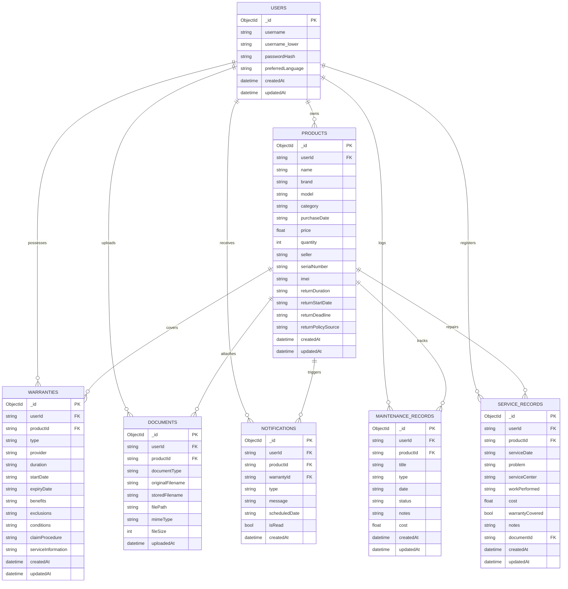

# OWNIT - Database Schema & Data Modeling

> **Database**: MongoDB (NoSQL Document Store)  
> **Driver**: Motor (AsyncIO Python driver)  
> **Target Audience**: Academic / College Project Reviewers and Database Administrators

---

## 1. Data Modeling Philosophy

OWNIT leverages **MongoDB** to accommodate the diverse, semi-structured nature of consumer products, multi-component warranties, preventive maintenance logs, and receipt OCR metadata.

### Core Principles
1. **Multi-Tenant User Isolation**: Every collection embeds an indexed `userId` string representing the owner. Queries strictly enforce `{"userId": user_id}`.
2. **Denormalization for Fast Aggregation**: Key product metadata (such as `productName`, `productBrand`) is denormalized into warranties, maintenance, service records, and notifications to eliminate expensive joins during high-frequency dashboard queries.
3. **Optimized Compound Indexing**: Compound indexes guarantee fast, indexed queries for status filtering, chronological sorting, and notification deduplication.

---

## 2. Collections Overview & Entity Relationship Diagram

---

## 3. Detailed Collection Schemas

### 3.1 `users` Collection
Stores user identity, hashed credentials, and UI language preferences.

| Field | BSON Type | Required | Description | Constraints & Index |
|:---|:---|:---:|:---|:---|
| `_id` | ObjectId | Yes | Unique user document ID | Primary Key |
| `username` | String | Yes | Display username | Min 3, Max 30 chars |
| `username_lower` | String | Yes | Normalized lowercase username | **Unique Index**: `unique_username_lower_idx` |
| `passwordHash` | String | Yes | bcrypt hashed password | Never exposed in API responses |
| `preferredLanguage`| String | Yes | UI/AI language preference | Default `"en"` (`en`, `hi`, `te`) |
| `createdAt` | Date | Yes | UTC creation timestamp | System timestamp |
| `updatedAt` | Date | Yes | UTC modification timestamp | Auto-updated |

---

### 3.2 `products` Collection
Stores registered products, purchase information, and return tracking metadata.

| Field | BSON Type | Required | Description | Constraints & Index |
|:---|:---|:---:|:---|:---|
| `_id` | ObjectId | Yes | Unique product ID | Primary Key |
| `userId` | String | Yes | User owner ID | **Index**: Compound `(userId, createdAt)` |
| `name` | String | Yes | Product name | Max 150 chars |
| `brand` | String | No | Manufacturer brand name | Text searchable |
| `model` | String | No | Model number/name | Text searchable |
| `category` | String | Yes | Product category | e.g., Mobile, Laptop, TV, Appliance |
| `purchaseDate` | String | Yes | Purchase date in ISO format | `YYYY-MM-DD` |
| `price` | Double | Yes | Purchase price in ₹ INR | $\ge 0.0$ |
| `quantity` | Int32 | Yes | Units purchased | Default `1` |
| `seller` | String | No | Store / E-commerce retailer | e.g., Amazon India, Reliance Digital |
| `serialNumber` | String | No | Hardware Serial Number | Indexable text |
| `imei` | String | No | Mobile IMEI identifier | Optional 15 digits |
| `returnDuration` | String | No | Return window description | e.g., `"7 Days"`, `"14 Days"` |
| `returnStartDate`| String | No | Start of return window | ISO `YYYY-MM-DD` |
| `returnDeadline` | String | No | Exact return window deadline | ISO `YYYY-MM-DD` |
| `returnPolicySource`| String | No | Origin of return terms | Verified Seller Policy |
| `notes` | String | No | Custom user notes | Max 1000 chars |
| `createdAt` | Date | Yes | Account record creation | ISO DateTime |
| `updatedAt` | Date | Yes | Account last updated | ISO DateTime |

---

### 3.3 `warranties` Collection
Stores modular warranty components (Comprehensive, Panel, Motor, Compressor, Extended).

| Field | BSON Type | Required | Description |
|:---|:---|:---:|:---|
| `_id` | ObjectId | Yes | Unique warranty component ID |
| `userId` | String | Yes | User owner ID |
| `productId` | String | Yes | Parent product reference ID |
| `type` | String | Yes | Coverage tier (e.g., `Comprehensive`, `Panel Warranty`) |
| `provider` | String | No | Warranty provider (e.g., `Samsung India`, `AppleCare+`) |
| `duration` | String | No | Duration string (e.g., `"12 Months"`, `"2 Years"`) |
| `startDate` | String | Yes | Coverage start date (`YYYY-MM-DD`) |
| `expiryDate` | String | Yes | Coverage expiration date (`YYYY-MM-DD`) |
| `benefits` | String | No | Included repair clauses and covered parts |
| `exclusions` | String | No | Explicit exclusions (physical damage, liquid spill) |
| `conditions` | String | No | Claim validity prerequisites |
| `claimProcedure`| String | No | Step-by-step manufacturer claim process |
| `serviceInformation`| String| No | Customer care toll-free number or service URL |
| `createdAt` | Date | Yes | Record creation timestamp |
| `updatedAt` | Date | Yes | Record modification timestamp |

---

### 3.4 `documents` Collection
Tracks uploaded files (receipts, warranty cards, repair bills) and their physical filesystem paths.

| Field | BSON Type | Required | Description |
|:---|:---|:---:|:---|
| `_id` | ObjectId | Yes | Unique document record ID |
| `userId` | String | Yes | User owner ID |
| `productId` | String | Yes | Associated product ID |
| `documentType` | String | Yes | `Purchase Bill`, `Warranty Card`, `Service Invoice`, `User Manual`, `Other` |
| `originalFilename`| String | Yes | Sanitized client original filename |
| `storedFilename` | String | Yes | UUID-tokenized physical filename |
| `filePath` | String | Yes | Absolute path on server disk |
| `mimeType` | String | Yes | Validated MIME type (`application/pdf`, `image/jpeg`, `image/png`) |
| `fileSize` | Int32 | Yes | File size in bytes (max 10MB) |
| `uploadedAt` | Date | Yes | Timestamp of upload |

---

### 3.5 `notifications` Collection
Stores milestone expiry notifications for active warranties.

| Field | BSON Type | Required | Description |
|:---|:---|:---:|:---|
| `_id` | ObjectId | Yes | Unique notification ID |
| `userId` | String | Yes | Recipient user ID |
| `productId` | String | No | Associated product ID |
| `warrantyId` | String | Yes | Associated warranty ID |
| `type` | String | Yes | `WARRANTY_EXPIRY_30D`, `15D`, `7D`, `1D`, `0D` |
| `message` | String | Yes | Notification display text |
| `scheduledDate` | String | Yes | Milestone target date (`YYYY-MM-DD`) |
| `isRead` | Boolean | Yes | Read/Unread flag (default `false`) |
| `createdAt` | Date | Yes | Creation timestamp |

**Compound Unique Index**:
- `{"userId": 1, "warrantyId": 1, "type": 1}` with `unique=True` (Guarantees zero duplicate reminder spam).

---

### 3.6 `maintenance_records` Collection
Tracks routine servicing and preventive care tasks.

| Field | BSON Type | Required | Description |
|:---|:---|:---:|:---|
| `_id` | ObjectId | Yes | Unique maintenance task ID |
| `userId` | String | Yes | User owner ID |
| `productId` | String | Yes | Associated product ID |
| `title` | String | Yes | Maintenance activity title |
| `type` | String | Yes | `Cleaning`, `Filter Replacement`, `Inspection`, `Software Update`, `Other` |
| `date` | String | Yes | Service date (`YYYY-MM-DD`) |
| `status` | String | Yes | `Scheduled`, `Completed`, `Overdue` |
| `notes` | String | No | Notes on maintenance |
| `cost` | Double | No | Cost incurred in ₹ INR (default 0.0) |
| `createdAt` | Date | Yes | Creation timestamp |
| `updatedAt` | Date | Yes | Last updated timestamp |

---

### 3.7 `service_records` Collection
Logs repair visits, authorized service centers, technician job sheets, and warranty coverage outcomes.

| Field | BSON Type | Required | Description |
|:---|:---|:---:|:---|
| `_id` | ObjectId | Yes | Unique service record ID |
| `userId` | String | Yes | User owner ID |
| `productId` | String | Yes | Associated product ID |
| `serviceDate` | String | Yes | Repair date (`YYYY-MM-DD`) |
| `problem` | String | Yes | Symptom / Defect description |
| `serviceCenter` | String | Yes | Authorized repair center or technician |
| `workPerformed`| String | Yes | Replacement parts and repair details |
| `cost` | Double | No | Total repair cost in ₹ INR |
| `warrantyCovered`| Boolean| Yes | Whether repair was free under warranty |
| `notes` | String | No | RMA number, Job Sheet ID, or notes |
| `documentId` | String | No | Optional attached repair invoice document ID |
| `createdAt` | Date | Yes | Creation timestamp |
| `updatedAt` | Date | Yes | Modification timestamp |

---

## 4. Indexing Strategy Summary

| Collection | Index Keys | Type | Purpose |
|:---|:---|:---:|:---|
| `users` | `{"username_lower": 1}` | Unique | Case-insensitive username uniqueness |
| `products` | `{"userId": 1, "createdAt": -1}` | Compound | Fast user vault listing |
| `products` | `{"userId": 1, "category": 1}` | Compound | Fast category filtering |
| `products` | `{"userId": 1, "brand": 1}` | Compound | Fast brand filtering |
| `warranties` | `{"userId": 1, "productId": 1}` | Compound | Fast product warranty retrieval |
| `warranties` | `{"userId": 1, "expiryDate": 1}` | Compound | Chronological expiry sorting |
| `documents` | `{"userId": 1, "productId": 1}` | Compound | Scoped product document attachments |
| `notifications` | `{"userId": 1, "warrantyId": 1, "type": 1}` | Unique | **Strict duplicate reminder prevention** |
| `notifications` | `{"userId": 1, "isRead": 1}` | Compound | Instant unread notification count |
| `maintenance_records`| `{"productId": 1, "userId": 1}` | Compound | Maintenance history lookups |
| `service_records`| `{"productId": 1, "userId": 1}` | Compound | Service history lookups |

---

*OWNIT Database Schema Documentation — Verified against MongoDB Driver implementation.*
