# OWNIT - Feature & Implementation Roadmap

This roadmap breaks down the upcoming implementation phases for the OWNIT platform into modular, incremental steps.

---

## 🗺️ Implementation Phases

```mermaid
graph LR
    Phase1[Phase 1: Project Skeleton & Foundation]
    Phase2[Phase 2: Database & Authentication]
    Phase3[Phase 3: Product & Document Management]
    Phase4[Phase 4: OCR Receipt Processing]
    Phase5[Phase 5: Warranty & Lifecycle Engine]
    Phase6[Phase 6: Local AI Assistant]
    Phase7[Phase 7: Multilingual & Advanced Features]

    Phase1 --> Phase2
    Phase2 --> Phase3
    Phase3 --> Phase4
    Phase4 --> Phase5
    Phase5 --> Phase6
    Phase6 --> Phase7
```

---

## 📌 Phase Details

### Phase 1: Project Skeleton & Foundation (Current Module)
- [x] Monorepo folder hierarchy (`frontend/`, `backend/`, `docs/`)
- [x] Baseline dependencies for FastAPI and React + Vite
- [x] Clean environment templates and `.gitignore` configurations
- [x] Developer onboarding documentation

### Phase 2: Database & Authentication
- [ ] MongoDB connection setup with asynchronous Motor client
- [ ] User schema (Email, Password hash, Preferred Language, Created Date)
- [ ] JWT authentication (Signup, Login, Refresh tokens, Password hashing with bcrypt)
- [ ] Auth context and protected routes in React

### Phase 3: Product & Document Management
- [ ] Product models (Name, Category, Brand, Serial Number, Purchase Date, Price, Store)
- [ ] Document attachment support (Invoices, manuals, warranty cards)
- [ ] Product listing, search, filtering, and detail views in Frontend

### Phase 4: OCR Receipt Processing
- [ ] Local Tesseract OCR integration
- [ ] Invoice/receipt upload handling and text pre-processing
- [ ] Extraction parser for itemized multi-product receipts
- [ ] Automated product draft creation from receipts

### Phase 5: Warranty & Lifecycle Engine
- [ ] Warranty models (Component warranties, exclusions, benefits, claim contacts)
- [ ] Return window calculator & countdown reminders
- [ ] Maintenance tracking & Service history timeline
- [ ] "Product Life Score" calculation algorithm

### Phase 6: Local AI Assistant (Ollama)
- [ ] Ollama integration with local model (e.g. LLaMA 3.2 / Mistral)
- [ ] Product-specific conversational assistant (Querying manual / warranty terms)
- [ ] Warranty coverage analyzer & step-by-step claim letter assistant

### Phase 7: Multilingual & Advanced Features
- [ ] Multi-language UI support (English, Hindi, Telugu)
- [ ] Compatible accessory recommendation module
- [ ] Recall & safety alert notifier
- [ ] End-to-end integration testing & production hardening
